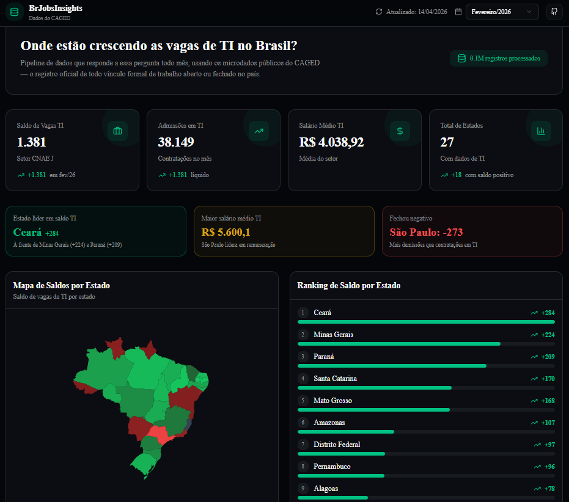

# BrJobsInsights

**Onde estão crescendo as vagas de TI no Brasil?**

> Pipeline de dados + dashboard que responde essa pergunta todo mês, usando os microdados públicos do **CAGED** (Cadastro Geral de Empregados e Desempregados).

[](https://jobs-insights-dashboard.vercel.app)
[](https://nextjs.org)
[](https://supabase.com)
[](https://python.org)

> **4,5M+ registros processados por mês · 27 estados · dados públicos do CAGED via FTP do Ministério do Trabalho**



---

## Demo

O projeto está disponível em produção:

**[https://jobs-insights-dashboard.vercel.app](https://jobs-insights-dashboard.vercel.app)**

Hospedado na Vercel com deploy contínuo a partir da branch `main`. A cada `git push`, uma nova versão é publicada automaticamente.

---

## O que é

Pipeline end-to-end que processa ~200MB de microdados brutos por mês direto do FTP do Ministério do Trabalho, filtra as ocupações de TI pela seção J do CNAE, agrega admissões e demissões por estado e entrega os resultados num dashboard interativo com mapa coroplético, ranking e série histórica.

O Brasil tem um paradoxo: existem vagas abertas em regiões onde os candidatos não estão mirando, por falta de informação. O CAGED registra tudo isso mensalmente — mais de **4,5 milhões de registros por arquivo**. Este projeto automatiza a coleta, limpeza e visualização desses dados de forma que qualquer pessoa consiga responder, em segundos, onde o mercado de TI está crescendo.

### Decisões técnicas

| Decisão | Motivo |
|---------|--------|
| **Supabase** | PostgreSQL gerenciado com API REST pronta, RLS nativo e zero servidor para administrar |
| **Next.js** | Backend e frontend no mesmo repositório, deploy em um clique no Vercel, API Routes sem infraestrutura adicional |
| **pandas + ftplib** | Processamento eficiente de arquivos CSV de 200MB+ em memória, sem dependência de ferramentas externas |
| **SWR** | Cache client-side com revalidação automática, evita requisições desnecessárias ao banco |
| **react-simple-maps** | Mapa SVG leve e customizável, sem dependência de APIs de mapas externas |

---

## Arquitetura

```
FTP do Ministério do Trabalho (ftp.mtps.gov.br)
        │
        ▼
  extractor.py          ← download .7z, descompactação, limpeza com pandas
        │
        ▼
  loader.py             ← inserção em lotes no Supabase/PostgreSQL
        │
        ▼
  Supabase (PostgreSQL) ← armazenamento na nuvem
        │
        ▼
  Next.js Dashboard     ← API Routes + visualização web
```

---

## Stack

| Camada | Tecnologia |
|--------|------------|
| **Extração** | Python, ftplib, py7zr, pandas |
| **Banco** | Supabase (PostgreSQL) |
| **Dashboard** | Next.js 16, TypeScript, Tailwind CSS v4, Recharts, shadcn/ui |
| **Deploy** | Vercel |

---

## Como rodar o projeto do zero

### Pré-requisitos

Antes de começar, certifique-se de ter instalado:

- [Node.js 18+](https://nodejs.org)
- [pnpm](https://pnpm.io) — `npm install -g pnpm`
- [Python 3.10+](https://www.python.org)
- Uma conta gratuita no [Supabase](https://supabase.com)

---

### Passo 1 — Criar o projeto no Supabase

1. Acesse [supabase.com](https://supabase.com) e faça login
2. Clique em **New project**
3. Dê um nome (ex: `brjobs-insights`), escolha uma senha e selecione a região **South America (São Paulo)**
4. Aguarde ~2 minutos até o projeto ficar pronto
5. Vá em **Settings > API** e copie:
   - `Project URL` → algo como `https://xyzabc.supabase.co`
   - `anon public` → chave que começa com `eyJ...`
   - `service_role` → chave que começa com `eyJ...` (mantenha em segredo)

---

### Passo 2 — Criar as tabelas no banco

1. No painel do Supabase, clique em **SQL Editor** no menu lateral
2. Clique em **New query**
3. Copie e cole todo o conteúdo do arquivo `scripts/001_create_tables.sql`
4. Clique em **Run**
5. Deve aparecer a mensagem: `Success. No rows returned`

---

### Passo 3 — Configurar as variáveis de ambiente

Na raiz do projeto, crie um arquivo chamado `.env.local` com o seguinte conteúdo:

```env
NEXT_PUBLIC_SUPABASE_URL=https://seu-projeto.supabase.co
NEXT_PUBLIC_SUPABASE_ANON_KEY=sua-anon-key
SUPABASE_SERVICE_ROLE_KEY=sua-service-role-key
```

Substitua os valores pelas chaves copiadas no Passo 1.

---

### Passo 4 — Instalar dependências e rodar o dashboard

```bash
# Instala as dependências do projeto
pnpm install

# Sobe o servidor de desenvolvimento
pnpm dev
```

Abra o navegador em **http://localhost:3000**

> Neste momento o dashboard vai abrir mas mostrar erro, pois o banco ainda está vazio. Isso é normal — continue para o próximo passo.

---

### Passo 5 — Rodar o pipeline e popular o banco

O pipeline baixa os microdados do CAGED direto do FTP do Ministério do Trabalho, processa e insere no Supabase.

```bash
# Entra na pasta do pipeline
cd scripts/pipeline

# Instala as dependências Python
pip install py7zr pandas supabase requests

# Roda para um mês específico (recomendado começar com os mais recentes)
python run_pipeline.py 2026 2    # Fevereiro/2026
python run_pipeline.py 2026 1    # Janeiro/2026
python run_pipeline.py 2025 12   # Dezembro/2025
```

> Cada mês leva entre 3 e 5 minutos para baixar e processar (~200MB por arquivo).
> O pipeline cria as tabelas automaticamente se ainda não existirem.

Para rodar o mês mais recente disponível automaticamente:

```bash
python run_pipeline.py
```

---

### Passo 6 — Ver os dados no navegador

1. Com o servidor rodando (`pnpm dev`), acesse **http://localhost:3000**
2. O dashboard vai carregar com os dados reais do CAGED
3. Use o seletor de mês no canto superior direito para alternar entre os meses carregados
4. Explore os gráficos:
   - **Mapa do Brasil** — saldo de vagas TI por estado (verde = positivo, vermelho = negativo)
   - **Ranking de estados** — top 10 por saldo ou salário médio
   - **Evolução temporal** — admissões vs demissões nos últimos meses
   - **Diversidade de gênero** — distribuição por sexo nas contratações
   - **Tabela detalhada** — todos os estados com busca e ordenação

---

## Variáveis de ambiente necessárias

| Variável | Onde usar | Descrição |
|----------|-----------|-----------|
| `NEXT_PUBLIC_SUPABASE_URL` | Dashboard + Pipeline | URL do projeto Supabase |
| `NEXT_PUBLIC_SUPABASE_ANON_KEY` | Dashboard | Chave pública (leitura) |
| `SUPABASE_SERVICE_ROLE_KEY` | Pipeline | Chave privada (escrita) |

> Para o pipeline Python, as variáveis precisam estar no ambiente do terminal. No Windows use `$env:VARIAVEL="valor"` antes de rodar o script, ou configure no `.env` do sistema.

---

## Estrutura do Projeto

```
brjobs-insights/
├── app/
│   ├── api/caged/route.ts     # API que busca dados do Supabase
│   ├── layout.tsx
│   └── page.tsx               # Dashboard principal
├── components/dashboard/       # Componentes do dashboard
│   ├── brazil-map.tsx
│   ├── data-table.tsx
│   ├── gender-chart.tsx
│   ├── header.tsx
│   ├── metric-card.tsx
│   ├── state-ranking.tsx
│   ├── tech-stack.tsx
│   └── timeline-chart.tsx
├── lib/
│   └── supabase/              # Clientes Supabase
├── scripts/
│   ├── 001_create_tables.sql  # Schema do banco
│   └── pipeline/
│       ├── extractor.py       # Download e limpeza do FTP
│       ├── loader.py          # Carrega no Supabase
│       ├── setup_db.py        # Cria tabelas automaticamente
│       └── run_pipeline.py    # Orquestrador
└── README.md
```

---

## Tabelas do Banco

| Tabela | Descrição |
|--------|-----------|
| `monthly_summary` | Métricas agregadas por mês |
| `state_data` | Admissões, demissões e saldo por estado |
| `timeline_data` | Série histórica mensal |
| `gender_data` | Distribuição por gênero |
| `job_records` | Registros detalhados (amostra) |

---

## Deploy na Vercel

O projeto está configurado para deploy automático na Vercel. A cada push para a branch `main`, uma nova versão é publicada sem nenhuma intervenção manual.

### Publicar sua própria instância

1. Faça um fork do repositório
2. Acesse [vercel.com](https://vercel.com) e importe o projeto pelo GitHub
3. Configure as variáveis de ambiente no painel da Vercel (**Settings > Environment Variables**):

| Variável | Descrição |
|----------|-----------|
| `NEXT_PUBLIC_SUPABASE_URL` | URL do seu projeto Supabase |
| `NEXT_PUBLIC_SUPABASE_ANON_KEY` | Chave pública (leitura) |
| `SUPABASE_SERVICE_ROLE_KEY` | Chave privada (escrita, usada apenas no pipeline) |

4. Clique em **Deploy** — a Vercel detecta automaticamente o Next.js e configura o build

> A `SUPABASE_SERVICE_ROLE_KEY` é usada apenas pelo pipeline Python local. No dashboard em produção, apenas as chaves `NEXT_PUBLIC_*` são necessárias.

---

## Autor

**Jonas Ferreira Silva** — [@jonasferreira-silva1](https://github.com/jonasferreira-silva1)

## Licença

MIT
